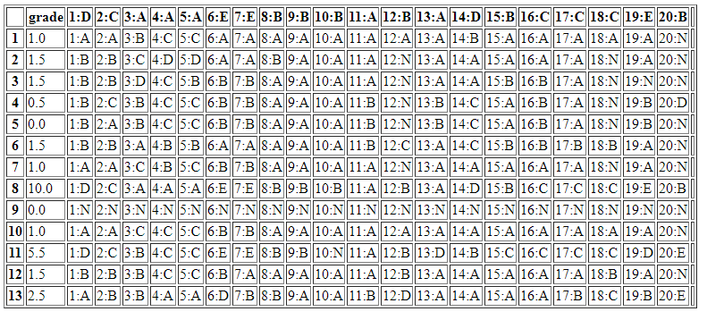

# PDF Template corrector

Program that takes a PDF with many proof templates and returns a table with the grade to each one.
To make use please download the 'default.pdf' and apply to your students.
To run some tests there are two proofs at input folder.

The Flask server is corrector_ui.py

To run in Windows you must install Poppler and add to your Path variables as described in the pdf2image documentation:
https://github.com/Belval/pdf2image

Other dependencies:
flask, matplotlib, pandas, opencv-python

I will work in an English version template in the future.

# GabaritoPDF

Gabarito em pdf para prova padrão

Baixar arquivo 'default.pdf' para usar o programa.
Exemplos de provas resolvidas se encontram na input para teste.

